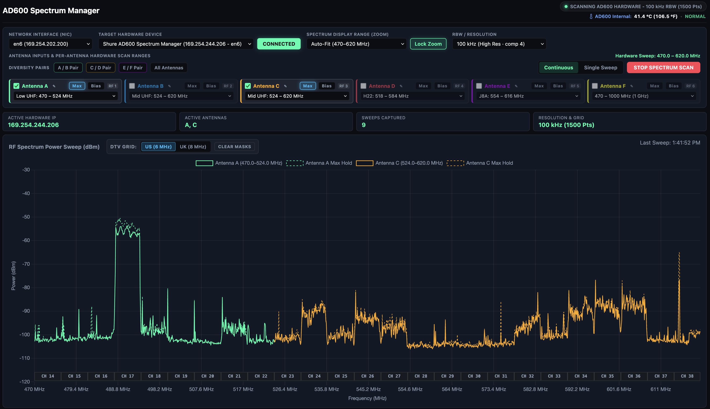

# Shure AD600 Web-Based Spectrum Scanner & Manager

A modern, high-performance web dashboard for real-time RF spectrum analysis, antenna diversity management, and remote hardware telemetry control for the **Shure Axient Digital AD600 Spectrum Manager**.



---

## Why This Project Exists

In standard production workflows, connecting to the Shure AD600 with Wireless Workbench (WWB) limits the live spectrum view to a single computer and a single operator.

This application was built to break through that single-screen bottleneck and unlock **collaborative RF workflows** across production teams:
* **Simultaneous Multi-User Access**: Any number of engineers, technicians, and coordinators can open the live spectrum plot at the same time on their own screens over the local network.
* **Multi-Device Support**: Responsive web layout optimized for **iPads, tablets, smartphones, and laptops**, allowing team members to carry live spectrum monitoring directly to the stage, backstage, or venue perimeter during walk-tests and rehearsals.
* **Zero Client Installation**: Team members simply open a web browser on their device to monitor real-time sweeps and antenna status without needing to install desktop software.

---

## Overview

The Shure AD600 is an industry-standard wideband RF scanner covering **174 MHz to 2.0 GHz**. This application communicates directly with the AD600 over your local network, managing real-time device control, automated frequency configuration, and continuous streaming spectrum telemetry.

It serves an interactive, low-latency dashboard accessible from any web browser on your computer or mobile device.

---

## Key Features

### Real-Time RF Spectrum Analysis
* **High-Speed Hardware Sweeping**: Continuously samples and plots live RF energy (dBm) with fast frame rates.
* **Selectable Resolution Bandwidth (RBW)**:
  * `50 kHz` (Very High Resolution)
  * `100 kHz` (High Resolution)
  * `350 kHz` (Standard Fast Sweep)
  * `900 kHz` (High-Speed Overview)
* **Phosphor Persistence & Max-Hold**: Live instantaneous sweeps with optional dotted peak-memory max-hold traces per antenna.
* **Single-Shot & Continuous Modes**: Capture single sweep snapshots or stream uninterrupted real-time sweeps.

### Per-Antenna Hardware Ranges & Diversity Pairs
* **Discrete Antenna Assignments**: Assign independent frequency ranges to individual physical RF inputs (Antennas A through F).
* **Pre-configured Frequency Presets**:
  * **Shure Bands**: G57 (470–608 MHz), G57+ (470–616 MHz), G10 (470–542 MHz), H22 (518–584 MHz), J8 (626–664 MHz), J8A (554–616 MHz), K54 (608–663 MHz), X55 (940–960 MHz).
  * **Sennheiser Bands**: A1–A4 (470–558 MHz), A5–A8 (550–608 MHz).
  * **Frequency Spans**: VHF (174–216 MHz), Low UHF (470–524 MHz), Mid UHF (524–620 MHz), Upper (608–1000 MHz), AFTRCC (1435–1525 MHz), 470–1000 MHz, 470–2000 MHz, 174–1000 MHz, and Full Span (174–2000 MHz).
  * **Custom MHz Ranges**: Arbitrary user-defined start and stop frequencies.
* **Diversity Pair Coupling**: Group paired antennas (`A+B`, `C+D`, `E+F`) into unified interface cards locked to matching frequency windows.
* **Intelligent Sweep Optimization**: The engine automatically computes the tightest bounding frequency envelope across all active inputs and configures the hardware oscillator to sweep only that window. Sweeping a 150 MHz span (e.g. 470–620 MHz) is **~3.5x faster** than scanning all of UHF.

### 12V DC Antenna Bias Power & Telemetry
* **Live Status Polling**: Instantly reads the active hardware 12V DC bias state across all antenna inputs (A–F) upon network connection.
* **Remote Toggle**: Turn antenna DC bias power on or off directly from the browser interface with immediate hardware verification.

### Hardware Health & Environmental Monitoring
* **Internal Temperature**: Continuous live temperature telemetry in both Celsius and Fahrenheit (°C and °F).
* **Cooling Fan State**: Real-time monitoring of internal chassis cooling and thermal health.

### Interactive DTV Station Masks
* **US & UK Standards**: Toggle between **US ATSC (6 MHz channels)** and **UK DVB-T/T2 (8 MHz channels)** channel grids.
* **Station Exclusion Masks**: Click any TV channel marker along the frequency axis to toggle a semi-opaque exclusion overlay across the spectrum display, helping you avoid broadcast TV transmitters.

### Zero-Scroll Compact Layout
* Squeezed, ergonomic control plane designed to display all controls, antenna inputs, status badges, and the full RF spectrum chart within a single laptop or desktop viewport without scrolling.

---

## iPad & Mobile Browser Support

You can operate this application entirely from an **iPad**, tablet, or smartphone connected to the same Wi-Fi or LAN as your computer:

1. Launch the application on your computer.
2. Ensure your iPad is connected to the same Wi-Fi network or local subnet.
3. Open **Safari** on your iPad and navigate to:
   ```text
   http://<computer-name>.local:8080
   ```
   *(or use your computer's local IP address, e.g. `http://192.168.1.50:8080`)*

### Add to iPad Home Screen (Fullscreen Kiosk Mode)
In Safari on your iPad:
1. Tap the **Share** button (the square with an arrow pointing up).
2. Tap **Add to Home Screen**.
3. Launch the app from your home screen icon to enjoy a borderless, full-screen wireless spectrum analyzer.

---

## Quick Start & Installation

### Option 1: One-Click First Launch (Recommended)

#### macOS
1. Double-click **`start_mac.command`**.
2. If Node.js is not yet installed on your Mac, the script will automatically offer to install it via Homebrew or open the official Node.js installer page.
3. The dashboard will automatically start and open in your default browser at `http://localhost:8080`.

#### Windows
1. Double-click **`start_windows.bat`**.
2. If Node.js is missing, the script will offer to install it using Windows Package Manager (`winget`) or direct you to the official installer.
3. The application will start and open your browser at `http://localhost:8080`.

---

### Option 2: Manual Launch

#### Prerequisites
* **Node.js**: v16.0 or higher ([Download Node.js](https://nodejs.org/))
* **Python**: v3.8 or higher ([Download Python](https://www.python.org/))

#### Running the Server
Clone the repository and start the server:
```bash
git clone https://github.com/mbsound/AD600-Web-Based-Spectrum-Scan.git
cd AD600-Web-Based-Spectrum-Scan

node server.js
```
Open **`http://localhost:8080`** in your web browser.

---

## Network Configuration

* **Direct Ethernet Connection**: Set your computer's network interface to Link-Local / DHCP (typically `169.254.x.x`) to connect directly to the AD600's primary network port.
* **Network Discovery (SLP)**: The app listens on UDP port `57383` and standard Service Location Protocol (SLP) multicast (`239.255.255.253`) to auto-detect AD600 devices.
* **Firewall Ports**: Ensure your computer's local firewall permits:
  * TCP port `8080` (Inbound HTTP Web Dashboard)
  * UDP port `57383` (Inbound Shure Discovery & Device Telemetry traffic)

---

## Architecture & Code Structure

* `server.js`: Node.js web server, REST API router (`/api/status`, `/api/range`, `/api/bias`, `/api/antenna`, `/api/connect`), and unified single-page HTML5/Canvas dashboard.
* `engine/ad600_console.py`: Core hardware communications engine managing network sessions, embedded scan initialization, parameter control, and real-time hardware telemetry emission.
* `engine/ad600_bridge.py`: Local bridge engine interfacing the console process with the web server.
* `engine/ad600_native.py`: Low-level protocol framing, packet codecs, and data stream parsers.
* `engine/ad600_discovery.py`: Network interface enumeration and controller CID derivation.
* `start_mac.command`: macOS first-launch shell script with Node.js prerequisite checks.
* `start_windows.bat`: Windows first-launch batch script with automatic `winget` installation support.

---

## License

This project is licensed under the [MIT License](LICENSE).
