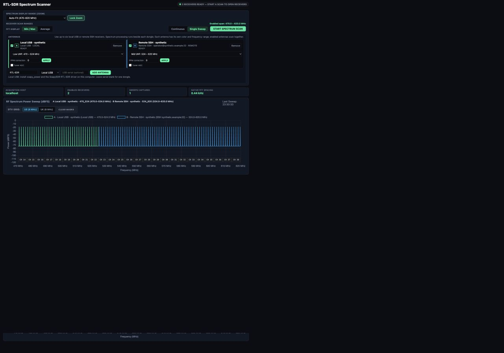

# RTL-SDR Web Spectrum Scanner

A browser dashboard for local and remote RTL-SDR receivers. Each acquisition host runs
[`soapy_power`](https://github.com/xmikos/soapy_power) beside its USB dongle. The dashboard receives
computed spectrum bins. Raw IQ stays on the acquisition host.

Two receiver modes are available:

| Mode | Acquisition host | Connection to the dashboard server |
| --- | --- | --- |
| Local USB | The computer running `server.js` | A local child process |
| Remote SSH | A remote computer with an RTL-SDR attached | SSH carries spectrum output and lifecycle commands |

Remote mode does not use `rtl_tcp`, SoapyRemote, MQTT, or a separate HTTP service.
The dashboard launches a temporary Python worker through SSH. It does not install files on the remote host.

## Features

- Up to six receivers, with independent frequency ranges and colors.
- Local and remote receivers in the same scan.
- Continuous scans or a single complete sweep.
- Live spectrum updates and progress after each tuner position.
- Native FFT bins with min/max rendering that preserves narrow peaks.
- An alternative display that averages bin power within each screen pixel.
- Per-receiver manual PPM correction and tuner AGC.
- Saved profiles that load disabled after restart.

The frequency limits are 24–1766 MHz. Actual coverage depends on the RTL-SDR tuner.
Automatic GSM/FM calibration and separate digital AGC controls are unavailable in these modes.
The previous calibration algorithms require IQ. Manual PPM correction remains available.

Both modes in a synthetic dashboard test (no RF hardware):



## Start the dashboard

The dashboard requires Node.js 16+ and Python 3.8+. Its Python bridge uses the standard library.
The acquisition host has additional requirements listed in the mode instructions.

```sh
node server.js
```

Open [the dashboard](http://localhost:8080). In **Antennas**, select a mode and add a receiver.
Enable its checkbox, select a frequency range, then start scanning.

`READY` means the bridge is ready to launch acquisition. It does not prove USB or SSH connectivity.
The receiver opens when scanning starts. Connection and dependency errors appear on the receiver card.

## Local USB mode

Install these components on the dashboard computer:

- SoapySDR, including its Python bindings.
- The [SoapyRTLSDR driver](https://github.com/pothosware/SoapyRTLSDR) and its RTL-SDR USB dependencies.
- [soapy_power](https://github.com/xmikos/soapy_power), SimpleSoapy, SimpleSpectral and NumPy.
- SciPy or pyFFTW for FFT processing, as recommended by upstream.

Use one compatible Python environment for the SoapySDR bindings and `soapy_power`.
Follow the upstream installation instructions for your operating system.

Check device discovery on the acquisition host:

```sh
SoapySDRUtil --find="driver=rtlsdr"
soapy_power --detect
```

Select **Local USB** in the dashboard. For one dongle, leave **USB serial** blank.
For multiple dongles on the same host, enter a distinct serial for each receiver.
The serial must match the value reported by the SoapySDR driver.
An unspecified serial reserves that host's default receiver and cannot coexist with another profile on the same endpoint.

## Remote SSH mode

Install the same acquisition components on the remote computer. Also install Python 3.8+ and an SSH server.
The remote worker expects a POSIX shell, such as the default shell on Linux or macOS.
The dashboard computer needs an OpenSSH client and Python 3.8+. It does not need local SoapySDR packages for remote-only use.

Set up key authentication and verify the remote host key before using the dashboard:

```sh
ssh operator@receiver-host
```

Check `soapy_power --detect` in that remote session. Then exit the session.
In the dashboard, select **Remote SSH** and enter the host, SSH port and optional user.
Add the remote dongle's USB serial if needed.

The app uses batch authentication and strict host-key checking. It never prompts for passwords or accepts unknown host keys.
It uses the SSH keys, agent and configuration available to the account running `server.js`.
The default remote executable is `soapy_power`. The default remote Python executable is `python3`.
For a remote virtual environment, set `SOAPY_REMOTE_BIN` to its absolute `soapy_power` path.

Stop, disable, configuration changes and dashboard shutdown close the worker's control pipe.
The worker terminates its acquisition child. A 20-second heartbeat timeout also stops acquisition after a broken connection.
Each new scan starts a new acquisition process. Configuration changes discard the interrupted pass before restarting.

## Acquisition and power values

Defaults are 1.8 MS/s, 4096 FFT bins, a Hann window, 20% edge cropping and eight FFT-length sample blocks per hop.
Upstream can round the acquisition buffer size. FFT overlap is explicitly disabled.
The driver resets streaming at retunes and applies a 30 ms tune delay.
There is no `rtl_tcp` IQ flush budget.

The bridge reads upstream `rtl_power_fftw` text output. One blank line ends a tuner segment. The next ends the sweep.
A truncated or malformed stream produces an error instead of a completed sweep.
The browser receives partial traces through the existing local HTTP bridge API.

`soapy_power` reports power spectral density per Hz. The bridge adds `10 log10(bin width in Hz)` to obtain FFT-bin power.
The chart labels this relative power as **dBFS**, based on the Soapy driver's normalized sample scale.
It is not calibrated RF input power in dBm. Compare physical measurements before relying on agreement with the previous backend.
The frequency spacing is approximately 439.45 Hz at the default sample rate. The window affects practical resolution.

Acquisition averaging combines measurements over time. The dashboard's **Average** display combines frequencies within a screen pixel.
These are separate operations. The **Min/max** display preserves the extrema in each pixel.

## Configuration

Set environment variables before starting `server.js`:

| Variable | Default | Purpose |
| --- | --- | --- |
| `WEB_PORT` | `8080` | Dashboard TCP port |
| `PYTHON_BIN` | `python3`, or `python` on Windows | Local bridge Python |
| `SOAPY_POWER_BIN` | `soapy_power` | Local executable path |
| `SOAPY_REMOTE_BIN` | `soapy_power` | Remote executable path |
| `SOAPY_REMOTE_PYTHON` | `python3` | Remote worker Python |
| `SSH_BIN` | `ssh` | Local SSH client executable |
| `SOAPY_AVERAGES` | `8` | FFT-length sample blocks per hop, 1–1024 |
| `RTL_SAMPLE_RATE` | `1800000` | Requested samples per second |
| `RTL_TUNER_GAIN_DB` | `25` | Manual tuner gain when AGC is off |
| `RTL_TUNER_AGC` | `0` | Default tuner AGC for new profiles |
| `RTL_SETTLE_MS` | `30` | Tune delay, 10–2000 ms |
| `RTL_REMOTE_CONTROL` | `1` | Set to `0` for host-only browser controls |
| `SOAPY_CLIENT_CONFIG_FILE` | `~/.soapy_power_spectrum_scanner/clients.json` | Profile file |

Profiles contain mode, endpoint, USB serial, range, PPM correction and tuner AGC.
The old `~/.rtl_tcp_spectrum_scanner/clients.json` is left untouched and is not imported.
An old TCP port does not identify an SSH endpoint.

The dashboard is available to LAN browsers at `http://<dashboard-host>:8080` by default.
Only the dashboard host opens SSH connections. Remote receiver hosts do not expose a spectrum HTTP port.

## Validation

```sh
node --check server.js
python3 -m compileall -q engine
python3 -m unittest discover -s tests -v
node tests/test_sweep_restart.js
node tests/test_fm_calibration.js
node tests/test_soapy_modes.js
```

The new tests use synthetic `soapy_power` output and a local SSH-command harness.
They cover parsing, partial updates, density conversion, process cleanup, restart cancellation, errors and profile persistence.
They do not establish real SSH authentication, USB access, receiver settling or RF accuracy.
The older IQ and calibration tests remain as regression checks for the retained reference modules.

For hardware acceptance, test each mode with a real dongle and known RF signals.
Check frequency placement, power scaling, band edges, repeated sweeps and stop/restart behavior.
Check that a lost SSH connection releases the remote dongle.

## Project structure

- `server.js`: Dashboard, profile management and HTTP API.
- `engine/soapy_power_backend.py`: Spectrum parser, acquisition lifecycle and local HTTP bridge.
- `engine/soapy_worker.py`: Acquisition worker used locally and over SSH.
- `tests/fixtures/`: Synthetic acquisition and SSH tools that never open hardware.
- `vendor/chart.umd.min.js`: Bundled Chart.js for offline use.
- `start_mac.command` and `start_windows.bat`: Launch helpers.

The earlier `rtl_tcp` and AD600 modules remain in `engine/` for reference. The dashboard does not launch them.
The older screenshots in `Screenshots/` show the previous backend and do not validate the new acquisition modes.

## License

This project is licensed under the [MIT License](LICENSE). Acquisition dependencies retain their own licenses.
