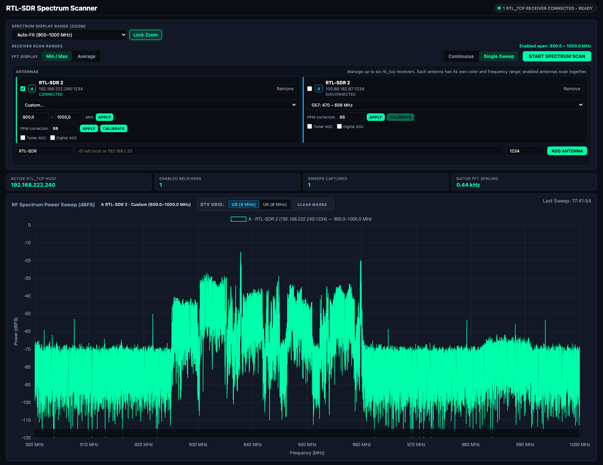
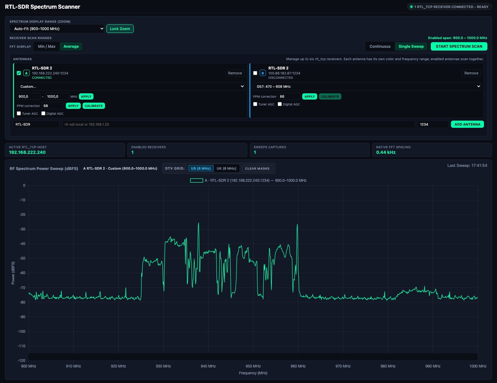

# RTL-SDR Web Spectrum Scanner

A browser dashboard for viewing live RF spectrum from an RTL-SDR receiver exposed over the
`rtl_tcp` protocol. The Node.js server serves the dashboard; a Python backend tunes across the
selected frequency span, computes native FFT bins, and streams each captured segment to the
browser as the sweep progresses.

The dashboard is designed for several viewers on the same LAN. Only the server needs to reach the
RTL-SDR node.

## Screenshots

The images show the same live sweep from the connected 900–1000 MHz test receiver. The other saved
receiver remains disconnected.

Min/max FFT-bin power in each display pixel:



Average FFT-bin power in each display pixel:



## Features

- Continuous sweeps or a single sweep snapshot.
- Manage up to six `rtl_tcp` receivers total, mapped to the original AD600 antenna slots and colors.
- Choose an independent frequency preset or custom scan span for each receiver.
- Set a signed PPM frequency correction independently for each receiver.
- Calibrate PPM with GSM900 FCCH references (kalibrate detector), or use a known FM station as a coarse fallback.
- Toggle tuner AGC and digital AGC independently for each receiver.
- Frequency ranges from 24 MHz to 1766 MHz for the tested R820T tuner.
- Native FFT-bin traces with viewport-sized min/max rendering that retains narrow peaks.
- Clear-write, max-hold, min-hold, and average traces.
- Browser access from desktop, tablet, or phone.

Signal levels are shown in **dBFS** (relative to the receiver's ADC full scale). The app does not
calibrate absolute power in dBm.

## Start the App

Requirements: Node.js 16+ and Python 3.8+. The backend uses only the Python standard library.

```sh
node server.js
```

Open [http://localhost:8000](http://localhost:8000), add one or more receivers in the **Antennas**
section, enable them, then start a sweep. The app starts without an `rtl_tcp` connection; receiver
endpoints are added from the dashboard and saved on the server.

The scanner defaults to a sample rate of `1800000` samples/s, manual tuner gain of `25` dB,
and both tuner AGC and digital AGC disabled. Toggle the two AGC modes on each receiver card; changes
are saved per receiver and applied live. `RTL_SAMPLE_RATE` and `RTL_TUNER_GAIN_DB` configure the
sample rate and manual tuner gain. `RTL_TUNER_AGC=1` and `RTL_DIGITAL_AGC=1` set defaults for new
receiver profiles and older profiles without saved AGC settings. Set `RTL_REMOTE_CONTROL=0` to make
browser controls available only on the server computer.

Each receiver must run its own `rtl_tcp` server and allow one connection from the app host. The app
opens one client connection for each enabled receiver, then sets the sample rate and tuner frequency
through each server's command stream. Do not add the same host and port more than once. Enabled
receivers scan together with their own frequency spans. Their spans and receiver profiles are
saved in `~/.rtl_tcp_spectrum_scanner/clients.json`, including each receiver's PPM correction and
AGC settings.
Profiles start disabled when the app restarts. PPM changes apply on the next tuner retune without
restarting the receiver connection; AGC toggles also take effect over the existing connection.

## Frequency Calibration

Stop scanning, warm up the receiver, and turn both AGCs off. Click **CALIBRATE** on its
receiver card. **GSM 900 · automatic (kalibrate)** is the default method. Click **MEASURE**
to search the 925–960 MHz base-station downlink band. The search ranks channels by power,
detects FCCH frequency-correction bursts, and compares measurements from up to three channels.
It normally takes about a minute when strong references are present; the search is bounded
to about three minutes, plus up to a minute to verify neighboring integer settings. **CANCEL** stops it promptly. Measurement alone never changes PPM.

The detector is a Python adaptation of [kalibrate-rtl](https://github.com/steve-m/kalibrate-rtl),
not a launch of the USB-only `kal` executable. It uses the existing rtl_tcp connection and
needs no additional packages or compiler. Attribution and the upstream license are in
`vendor/kalibrate-rtl/`. The backend temporarily selects 270833 samples/s for GSM, then restores
the normal sample rate on success, cancellation, or failure. Normal scan ranges are preserved.

Each accepted channel needs at least 30 burst measurements. Apply requires two stable channels
with a combined estimated uncertainty no greater than 0.35 ppm. The result shows each ARFCN,
frequency, burst count, and PPM estimate. Before returning a recommendation it temporarily tests
the two neighboring integer PPM settings on the same references and restores the saved PPM.
This addresses tuner quantization that can make simple rounding alternate between settings.
**APPLY CORRECTION** saves the integer with the lowest measured RMS residual to the receiver
profile; fractional PPM is reported for comparison but is not applied. Measure
again after Apply to verify the remaining offset. Uncertainty describes observed scatter and
channel agreement, not traceable laboratory accuracy. Tuner synthesis error and temperature
drift can still affect it.

This implementation covers GSM900/EGSM downlinks only, requires a normal scanner sample rate
of at least 1 MS/s, and expects a rough initial correction within approximately 40 kHz of the
carrier (about 42 ppm at 950 MHz). Use the FM fallback for larger initial errors. Lack of GSM
coverage, a poor 900 MHz antenna, interference, or clipping may prevent a usable result.

### FM fallback

Stop scanning, leave the receiver connected to warm up, and disable both AGCs. Click
**CALIBRATE** on its receiver card and select **FM broadcast · approximate**. Choose a local station or enter its known frequency,
then select a 20, 40, or 60 second measurement and click **MEASURE**. The included Łódź presets
are [Radio ZET 92.6 MHz](https://www.eurozet.pl/Nasze-marki/Stacje-radiowe/Radio-ZET),
[RMF FM 93.5 MHz](https://www.rmf.fm/index.html?a=odbior), and
[Radio Łódź 99.2 MHz](https://radiolodz.pl/wp-content/uploads/2026/01/Radio-Lodz-Akademia-Wokalna.pdf).

Calibration uses the existing receiver connection. It filters the station's channel and averages
FM phase differences at two tuner positions, avoiding the assumption that the strongest FFT bin
is the carrier. The result shows residual frequency error, estimated uncertainty, signal quality,
and a proposed correction relative to the current PPM setting. Weak, clipped, or inconsistent
captures cannot be applied. Scanner controls are locked during measurement; **CANCEL** releases
them without changing PPM. **APPLY CORRECTION** saves an accepted result to that receiver's profile.
Results expire after five minutes and configuration changes invalidate them.

This is an approximate calibration: programme modulation, multipath, nearby stations, transmitter
offset, and receiver temperature can bias it. The uncertainty estimate is a stability check,
not a traceable accuracy guarantee. Verify with a second strong station and use longer measurements
if estimates disagree. A suitable unmodulated reference is preferable for precise calibration.
The scan range and normal scan timing remain unchanged.

## How Scans Work

The backend captures 4096 complex I/Q samples at each tuner position, applies a Hann window, and
computes a radix-2 FFT. It streams the individual FFT bins after each tuner position. Bin spacing
is `RTL_SAMPLE_RATE / 4096` (about 439 Hz at the default 1.8 MS/s); this is the spacing between
reported samples, while the window also affects practical frequency resolution. The sample rate
sets the captured complex-signal bandwidth, and the scanner uses 80% of that span at each tuner
position to avoid edge bins. The chart can render per-pixel min/max envelopes or average FFT-bin
power. Min/max keeps narrow peaks visible; average smooths each screen pixel and can make narrow
peaks appear lower. A sweep covers the complete configured range; wide spans take longer because
the tuner must retune between segments. The receiver and tuner hardware limit capture bandwidth
and sensitivity.

Continuous mode repeats complete sweeps until stopped; Single mode captures one complete sweep.
The chart updates as each tuner segment completes. Each antenna shows progress, tuner frequency,
and elapsed time while scanning. The backend drains incoming IQ during FFT processing and waits
30 ms after each retune by default. Set `RTL_SETTLE_MS` before starting the server to choose a
different startup wait (10–2000 ms). After settling, it discards 200 ms of incoming IQ samples
before accepting a complete FFT frame. This flushes delayed samples that can otherwise appear
under the wrong frequency. Set `RTL_FLUSH_MS` (integer 0–5000, default 200) before starting the
server to change this sample budget; 0 disables the extra flush for diagnostic comparisons.
Lower values require verification on the actual receiver and network. For slower or burstier
connections, increase this budget (for example, to 1000 ms). The local Python bridge also accepts
`flushMs` through `/configuration` for live timing qualification; changing it invalidates the pass.
Keep both tuner and digital AGC off for repeatable power measurements. Set
`RTL_CAPTURE_DIAGNOSTICS=1` to log each capture's frequency, timing, discarded bytes, and pass ID.
PPM and AGC changes invalidate the current pass so traces do not mix receiver settings.
rtl_tcp does not acknowledge tuning or timestamp IQ, so the required delay depends on the receiver
and network; flushing is a conservative guard, not a hardware timing guarantee. The default
54 MHz span requires 38 tuner positions at 1.8 MS/s, about 9 seconds plus delivery and processing
time with default settling and flushing. No spectrum smoothing is applied by this capture guard.

The frequency range presets are convenience values. Manual scan ranges are limited to 24 MHz
through 1766 MHz, which match the R820T test node. Adjust those limits before using a different
tuner model with a different tuning range.

## Network Access

The dashboard listens on TCP port `8000`. Other devices can open `http://<server-ip>:8000` when
they share a network with the server. The server connects outward to the configured rtl_tcp host
and port; no incoming RTL-SDR connection to the dashboard computer is required.

By default, browsers on the LAN can operate the scanner. Use `RTL_REMOTE_CONTROL=0` to make them
view-only while keeping controls enabled on the server computer.

## Project Structure

- `server.js`: Node.js HTTP server, dashboard, and API.
- `engine/rtl_tcp_backend.py`: rtl_tcp client, FFT scanner, and local trace bridge.
- `vendor/chart.umd.min.js`: bundled Chart.js for offline dashboard use.
- `start_mac.command` and `start_windows.bat`: launch helpers.

The earlier AD600 protocol modules remain in `engine/` for reference. The dashboard uses the
rtl_tcp backend.

## Validation

Syntax checks:

```sh
node --check server.js
python3 -m py_compile engine/rtl_tcp_backend.py
python3 -m unittest discover -s tests -v
node tests/test_sweep_restart.js
node tests/test_fm_calibration.js
```

The regression checks use synthetic IQ and a localhost rtl_tcp simulator. They cover continuous
and single sweeps, restart cancellation, band coverage, upper-limit tuning, IQ buffering, and
configuration-before-start ordering. They do not establish physical receiver tuning performance.
Calibration tests cover modulated FM on both sides of the tuner center, correction sign, weak
and clipped samples, uncertainty rejection, cancellation, configuration invalidation, and stale
Apply requests. GSM tests also cover burst detection, continuous-tone rejection, channel agreement,
input stalls, cancellation and sample-rate restoration.

For hardware validation, connect to an enabled rtl_tcp receiver, start a scan, and confirm that
the bridge returns a trace with `unit: "dBFS"` and the configured frequency grid.

## License

This project is licensed under the [MIT License](LICENSE).
